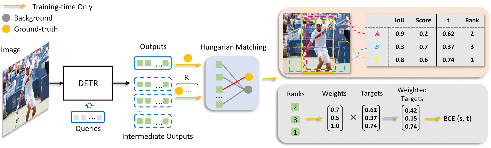

# AlignDETR
## Introduction
AlignDETR is a variant of DETR(DEtection with Transformer), with a simple IoU-Aware BCE loss and better performance! It aims to solve the issue of misalignment problem spotted in DETR's output.
For more details, please refer to our [paper on Arxiv](). 


## Installation 
See [installation instructions](INSTALL.md) 
## Usage
Train Example
```bash
python tools/train_net.py --config-file  aligndetr/aligndetr_k=2_r50_4scale_12ep.py --num-gpus 8
```
Evaluation Example
```bash
python tools/train_net.py --config-file  aligndetr/aligndetr_k=2_r50_4scale_12ep.py --num-gpus 8 --eval train.init_checkpoint=/path/to/checkpoint
```
## Model Zoo

|Model|AP|AP50|AP75|APs|APm|APl|weights|
|----|----|----|----|----|----|----|----|
|[AlignDETR-R50-12ep](aligndetr/configs/aligndetr_k%3D2_r50_4scale_12ep.py)|50.3|67.9|54.8|34.1|53.5|65.1|[Google Drive](https://drive.google.com/file/d/12xSxD_Z9KI8bejSlO1td1XcZ-Ns00rTi/view?usp=share_link)|
|[AlignDETR-R50-24ep](aligndetr/configs/aligndetr_k%3D2_r50_4scale_24ep.py)|51.3|68.9|55.4|34.2|54.8|66.3|[Google Drive](https://drive.google.com/file/d/1zQYe78fDdCmK3nwbAWYLvGCdQCFsTqoX/view?usp=share_link)|


## License
This project is released under the [Apache 2.0 license](LICENSE).
